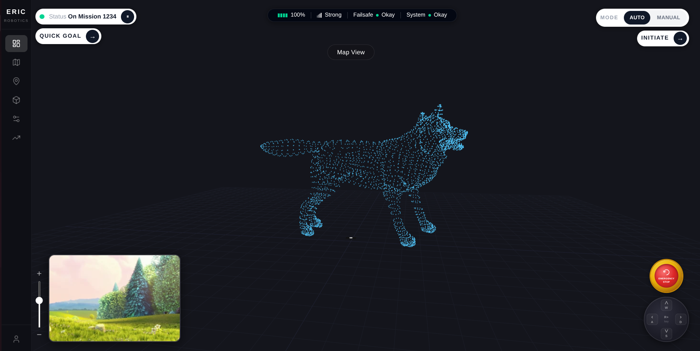
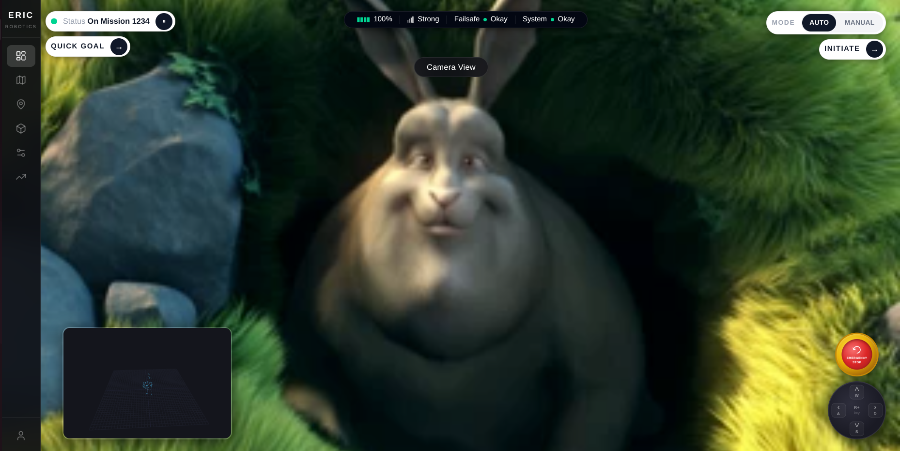
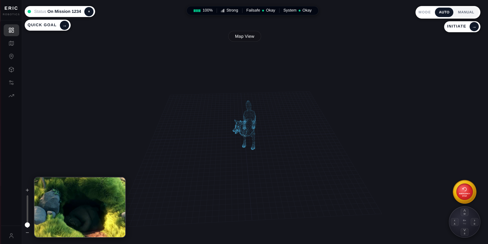
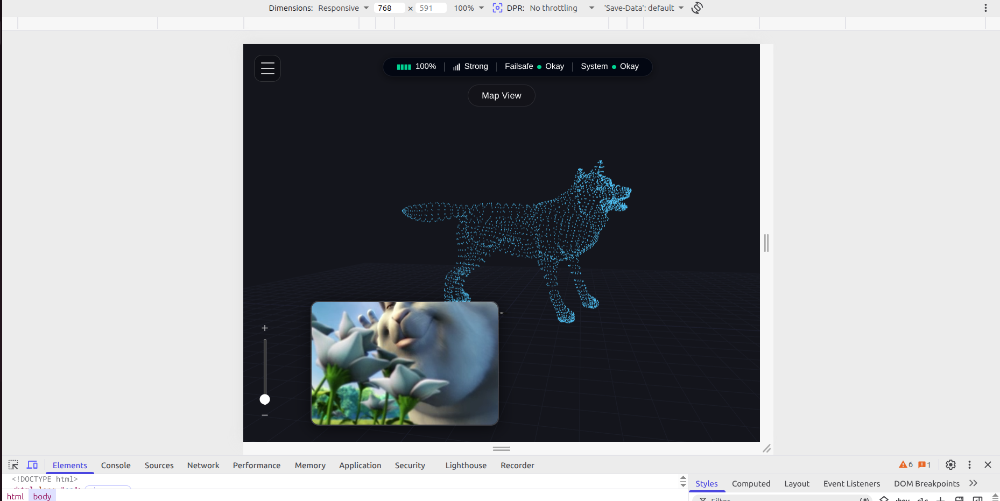
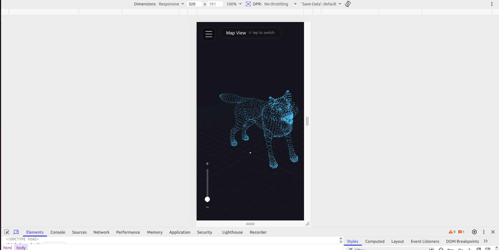

# Insight.IO Dashboard — ERIC Robotics

**Full Name:** Rishabh Jat
**Contact Number:** 6264276708  
**Email ID:** jat.rishabh02@gmail.com

---

## Screenshots

### Desktop — Map View


### Desktop — Camera View


### Desktop — Zoomed Out


### Tablet


### Mobile


---

## Overview

A single-page robot telemetry dashboard that faithfully recreates the Insight.IO interface shown in the demo. It features a **dual-view system** (live camera feed + interactive 3D point cloud map) that swaps on click, a system-status top bar, directional controls with WASD keyboard bindings, and an emergency stop button.

**Tech stack:** React 18 · Vite 5 · Three.js · Tailwind CSS · Lucide React

---

## Quick Start (local, fully offline)

```bash
# 1. Enter the project folder
cd insight-dashboard

# 2. Install dependencies (one-time)
npm install

# 3. Start the dev server
npm run dev
```

Open **http://localhost:5173** in your browser.

> All media files (`wolf.pcd`, `BigBuckBunny_320x180.mp4`) are served locally from `public/`. No internet required after `npm install`.

---

## Project Structure

```
insight-dashboard/
├── public/
│   ├── BigBuckBunny_320x180.mp4   (camera feed)
│   └── wolf.pcd                   (3D point cloud)
├── src/
│   ├── components/
│   │   ├── Sidebar.jsx
│   │   ├── TopBar.jsx
│   │   ├── VideoView.jsx
│   │   ├── MapView3D.jsx
│   │   ├── EmergencyStop.jsx
│   │   └── DPad.jsx
│   ├── App.jsx
│   └── index.css
└── README.md
```

---

## Features

| Feature | Details |
|---|---|
| View swap | Click the bottom-left thumbnail to swap camera ↔ map as main view |
| 3D Map | PCDLoader (Three.js) renders `wolf.pcd`; drag to rotate, scroll to zoom |
| Robot marker | Red box + pulsing ring at centre of point cloud |
| Camera feed | Local MP4, autoplay, muted, loops |
| WASD / Arrow keys | Highlight D-pad buttons; ready to wire to `/cmd_vel` |
| Mode toggle | AUTO / MANUAL switch in top-right |
| Emergency stop | Prominent gold+red button, bottom-right |
| Zoom slider | Vertical slider left of thumbnail |

---

## Architecture Decisions

- **React + Vite** — component-based structure, single `npm run dev` command, no config overhead.
- **Three.js PCDLoader** — built-in support for both ASCII and binary PCD formats; no extra library needed.
- **OrbitControls** — mouse rotate/zoom on the 3D map, works in both main and thumbnail size thanks to a `ResizeObserver` that keeps the renderer in sync with the container.
- **CSS position:absolute overlays** — UI elements float over the full-screen views without affecting layout flow. Z-index layers: main view (0) → thumbnail (6) → overlays (10).
- **Two live view instances** — both `MapView3D` and `VideoView` mount once and swap CSS classes (`view-main` / `view-thumb`); no remounting means a smooth swap with no reload.

---

## Extending to ROS 2 (bonus path)

Replace the static PCD load in `MapView3D.jsx` with a `roslibjs` subscription:

```js
import ROSLIB from 'roslib'
const ros = new ROSLIB.Ros({ url: 'ws://localhost:9090' })
const pcdTopic = new ROSLIB.Topic({
  ros,
  name: '/points_raw',
  messageType: 'sensor_msgs/PointCloud2',
})
pcdTopic.subscribe((msg) => { /* update Three.js points geometry */ })
```

Replace the video element in `VideoView.jsx` with an `` reading from a `web_video_server` topic URL for a live MJPEG stream.
